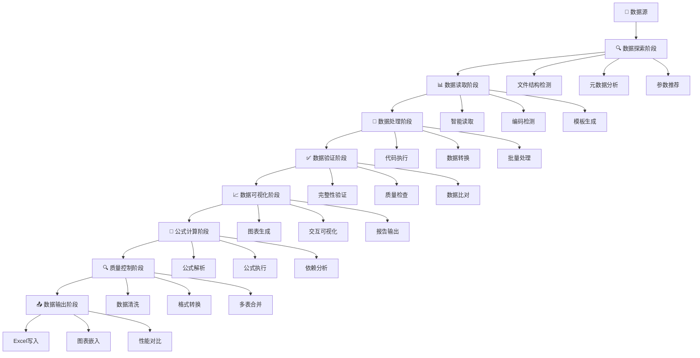
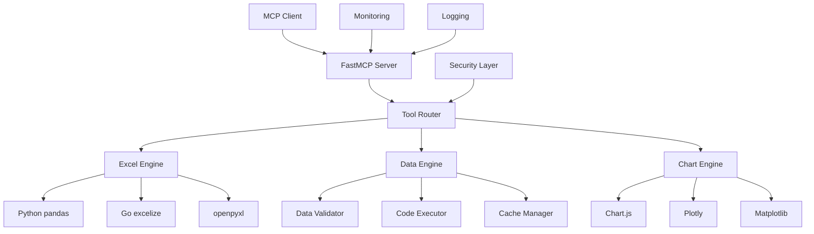
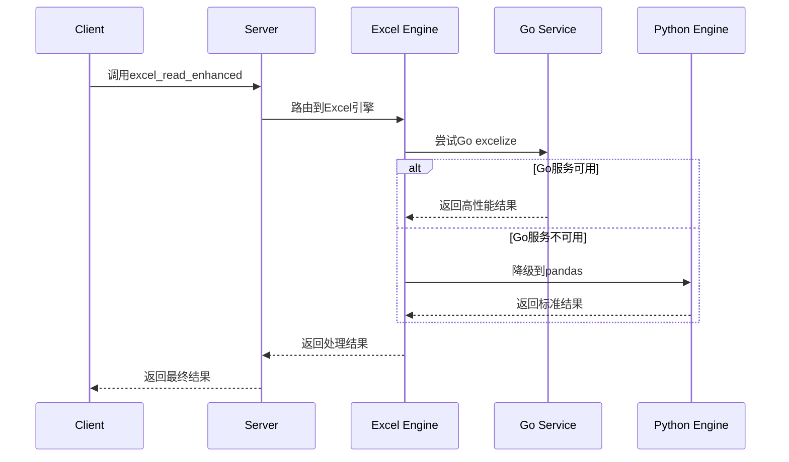
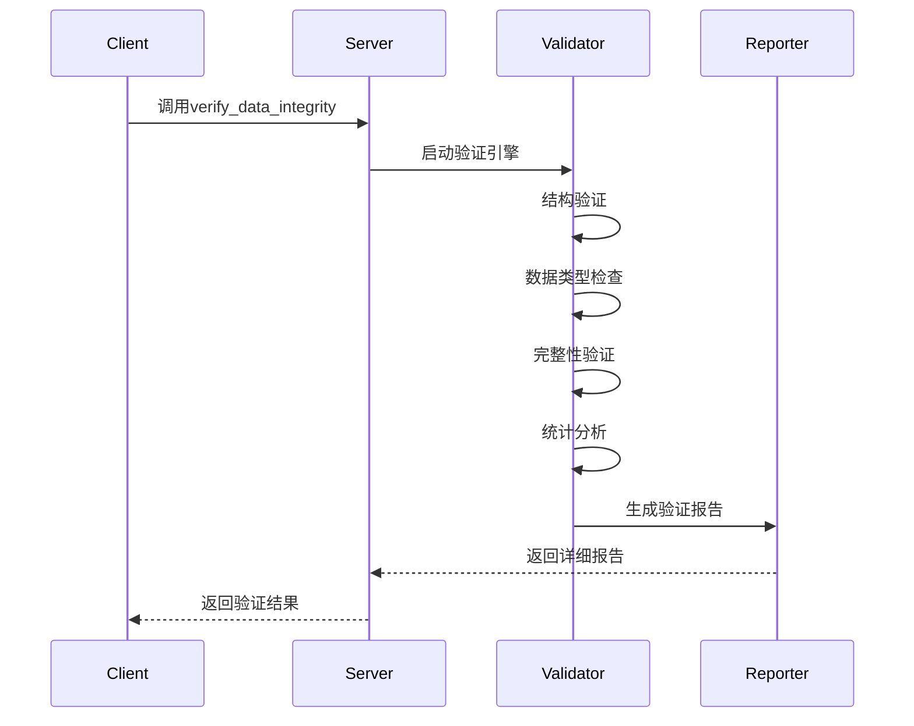
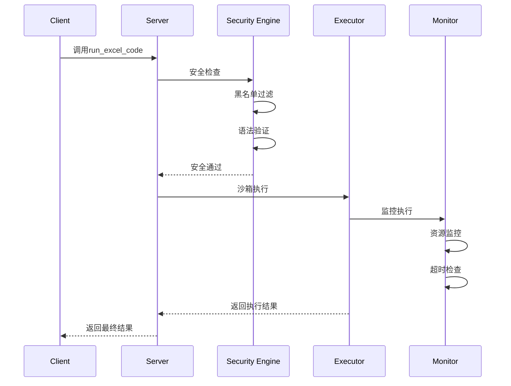
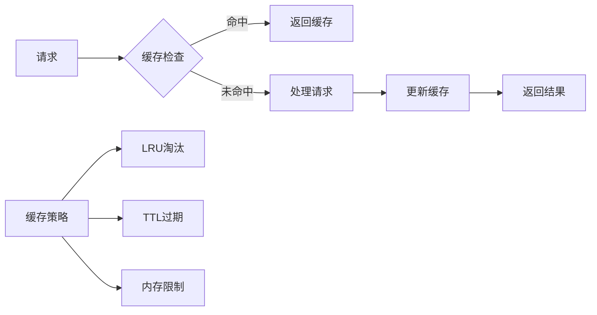
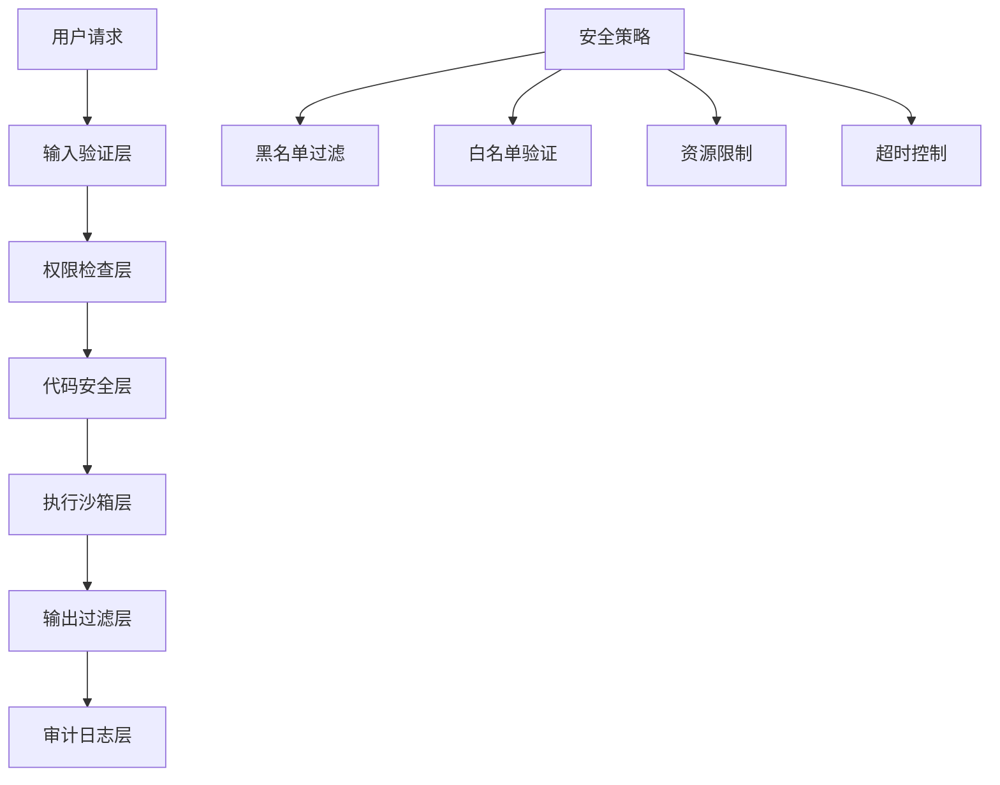
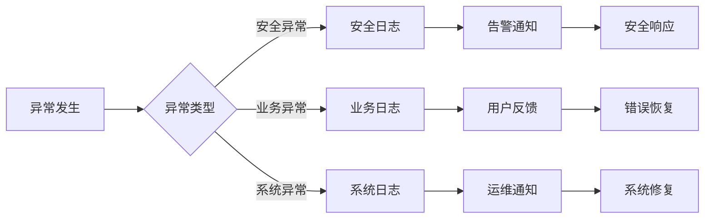
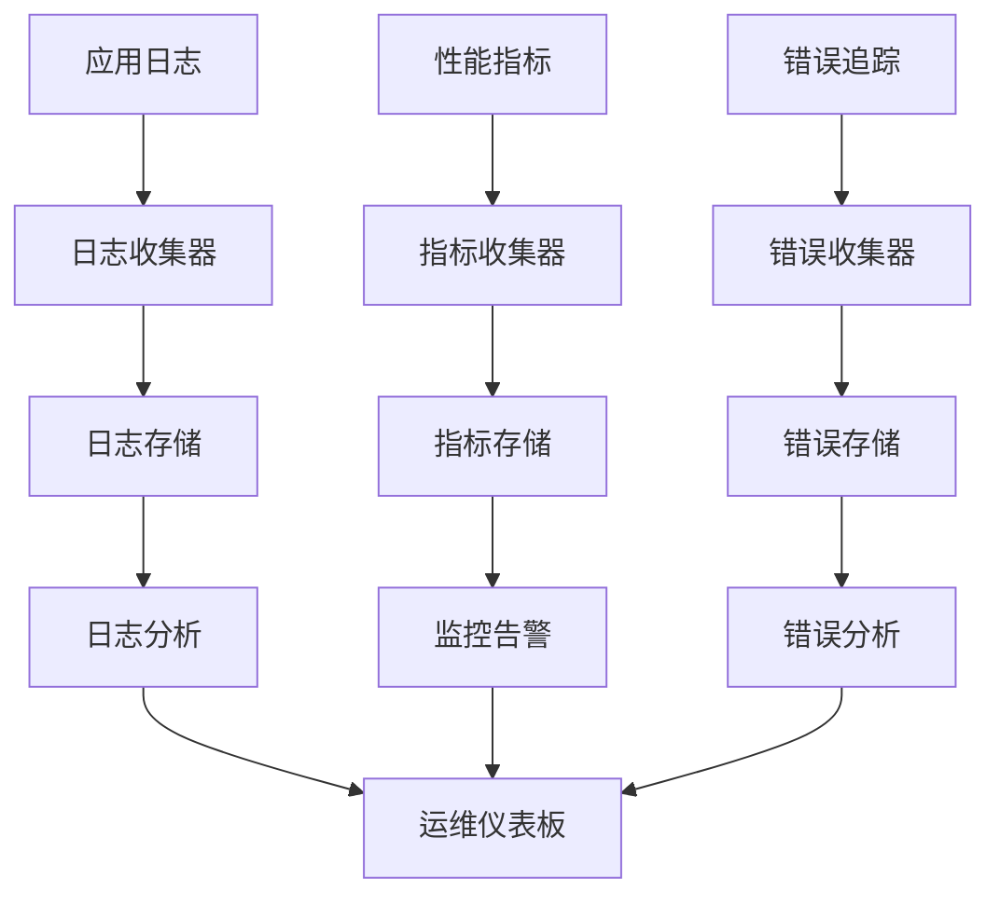

# ChatExcel MCP Server - 企业级增强版 v2.1.1

> **最新更新 (2025-06-19)**: pandas导入问题完全修复，项目结构优化完成，企业级功能全面就绪

> 🚀 **企业级Excel智能处理与数据分析MCP服务器** - 基于FastMCP构建的高性能数据处理解决方案

**chatExcel-mcp** 是一个基于 MCP (Model Context Protocol) 的企业级 Excel 智能处理服务器，提供强大的 Excel 文件分析、数据处理、公式计算和可视化功能。

## 🚀 核心特性

### 📊 31个专业MCP工具
- **数据读取与元数据分析** (2个工具): 智能编码检测、结构分析
- **数据处理与执行** (9个工具): 安全代码执行、参数推荐、模板生成
- **数据可视化** (3个工具): 交互式图表生成(Chart.js)
- **数据验证与质量控制** (12个工具): 多级质量检查、智能清洗
- **Excel公式处理** (5个工具): 公式解析、编译、执行、验证

### 🏗️ 双引擎架构
- **Python引擎**: 基于pandas/openpyxl的传统处理，支持复杂数据分析
- **Go引擎**: 高性能并发处理，适用于大规模数据处理(可选)

### 🧮 Excel公式引擎 (新增)
- **公式解析**: AST语法分析和安全验证，支持复杂嵌套公式
- **公式编译**: 代码生成和依赖分析，优化执行性能
- **公式执行**: 安全执行环境和结果验证，支持上下文计算
- **依赖分析**: 依赖图生成和循环检测，避免计算死锁
- **公式验证**: 语法检查和风险评估，确保公式安全性

### 🔍 数据质量控制 (增强)
- **多级质量检查**: 数据完整性、一致性、准确性全面验证
- **智能数据清洗**: 自动化数据清理和格式标准化
- **批量处理**: 并行处理多个Excel文件，提升处理效率
- **高级提取**: 多条件数据提取和内容分析
- **智能合并**: 多表格数据合并和配置化处理
- **字符格式转换**: 自动化字符格式转换和规则配置

### 🛡️ 企业级安全
- **代码安全**: AST分析和函数白名单，防止恶意代码执行
- **执行沙箱**: 隔离执行环境，保护系统安全
- **权限控制**: 细粒度访问控制和操作审计
- **依赖扫描**: 智能依赖分析和安全漏洞检测

### ⚡ 性能优化
- **智能缓存**: 多级缓存策略，减少重复计算
- **并发处理**: 异步任务执行，提升处理速度
- **内存管理**: 大文件分块处理，优化内存使用
- **错误恢复**: 自动重试机制和健康监控

[](https://python.org)
[](https://github.com/jlowin/fastmcp)
[](https://golang.org)
[](LICENSE)
[](pyproject.toml)
[](https://pypi.org/project/formulas/)
[](#-安全考虑)
[](#-性能优化)
[](#-运维工具)

## 📋 项目概述

ChatExcel MCP Server 是一个功能强大的模型上下文协议(MCP)服务器，专门为Excel文件处理、数据分析和可视化而设计。项目集成了Python生态系统的最佳数据处理库，并通过Go excelize库提供高性能Excel操作能力。

### 🎯 核心特性

- **31个专业MCP工具** - 覆盖数据读取、处理、验证、可视化、公式计算、数据质量控制全流程
- **双引擎架构** - Python pandas + Go excelize 混合处理引擎
- **Excel公式引擎** - 基于formulas库的完整Excel公式解析、编译和执行系统
- **数据质量控制** - 7个专业数据质量工具，支持高级数据清洗和验证
- **智能参数推荐** - 自动检测Excel文件结构并推荐最佳读取参数
- **企业级安全** - 多层安全机制，代码沙箱执行环境，公式安全验证
- **性能优化** - 缓存机制、并发处理、内存优化
- **健康监控** - 完整的服务监控、日志记录和错误追踪
- **可视化支持** - 交互式图表生成(Chart.js、Plotly、Matplotlib)

## 🛠️ MCP工具列表

本项目提供 **31个专业MCP工具**，覆盖Excel数据处理、分析、验证、公式计算和数据质量控制的完整生命周期。

### 📊 数据读取与元数据工具 (4个)
| 工具名称 | 功能描述 | 主要特性 |
|---------|----------|----------|
| `read_metadata` | CSV文件元数据读取和智能分析 | 编码检测、分隔符识别、数据统计 |
| `read_excel_metadata` | Excel文件元数据读取和完整性验证 | 多工作表分析、智能编码检测 |
| `excel_read_enhanced` | 增强版Excel读取工具 | Go excelize集成、智能参数推荐 |
| `excel_info_enhanced` | 增强版Excel文件信息获取 | 详细文件分析、工作表统计 |

### 🔧 数据处理与执行工具 (6个)
| 工具名称 | 功能描述 | 主要特性 |
|---------|----------|----------|
| `run_excel_code` | Excel代码执行引擎 | 安全沙箱、复杂格式参数支持、✅ pandas导入完全修复 |
| `run_code` | CSV代码执行引擎 | 安全环境、pandas集成、✅ 增强执行环境 |
| `excel_write_enhanced` | 增强版Excel写入工具 | 格式优化、样式支持 |
| `excel_chart_enhanced` | 增强版Excel图表生成 | 多种图表类型、自定义样式 |
| `excel_performance_comparison` | Excel性能对比分析 | Go vs Python性能测试 |
| `batch_data_verification_tool` | 批量数据验证工具 | 并发处理、批量报告 |

### 📈 数据可视化工具 (3个)
| 工具名称 | 功能描述 | 主要特性 |
|---------|----------|----------|
| `bar_chart_to_html` | 交互式柱状图生成 | Chart.js、响应式设计 |
| `pie_chart_to_html` | 交互式饼图生成 | 动画效果、数据标签 |
| `line_chart_to_html` | 交互式折线图生成 | 多维数据、趋势分析 |

### 🔍 数据验证与质量工具 (3个)
| 工具名称 | 功能描述 | 主要特性 |
|---------|----------|----------|
| `verify_data_integrity` | 数据完整性验证和比对核准 | 多种验证模式、详细报告 |
| `validate_data_quality` | 数据质量验证和改进建议 | 质量评分、优化建议 |
| `comprehensive_data_verification_tool` | 综合数据验证和核准工具 | 全面验证、质量评估、比对核准 |

### 🤖 智能辅助工具 (3个)
| 工具名称 | 功能描述 | 主要特性 |
|---------|----------|----------|
| `suggest_excel_read_parameters_tool` | Excel读取参数智能推荐 | 结构分析、参数优化 |
| `detect_excel_file_structure_tool` | Excel文件结构检测 | 多级表头、数据区域识别 |
| `create_excel_read_template_tool` | Excel读取代码模板生成 | 智能模板、参数配置 |

### 🧮 Excel公式处理工具 (5个)
| 工具名称 | 功能描述 | 主要特性 |
|---------|----------|----------|
| `parse_formula` | Excel公式解析器 | AST解析、语法分析、安全验证 |
| `compile_workbook` | Excel工作簿编译器 | 公式编译、代码生成、依赖分析 |
| `execute_formula` | Excel公式执行引擎 | 安全执行、上下文支持、结果验证 |
| `analyze_dependencies` | Excel公式依赖分析 | 依赖图生成、循环检测、影响分析 |
| `validate_formula` | Excel公式验证器 | 安全检查、语法验证、风险评估 |

### 🔍 数据质量控制工具 (7个) - **新增**
| 工具名称 | 功能描述 | 主要特性 |
|---------|----------|----------|
| `enhanced_data_quality_check` | 增强数据质量检查 | 多级质量检查、综合报告 |
| `extract_cell_content_advanced` | 高级单元格内容提取 | 多类型提取、格式化内容 |
| `convert_character_formats` | 字符格式自动化转换 | 批量转换、规则配置 |
| `extract_multi_condition_data` | 多条件数据提取 | 复杂条件、灵活筛选 |
| `merge_multiple_tables` | 多表格数据合并 | 智能合并、配置化处理 |
| `clean_excel_data` | Excel数据清洗 | 全面清洗、质量提升 |
| `batch_process_excel_files` | 批量Excel文件处理 | 并行处理、统一配置 |

---

## 📋 Workflow使用手册 - 31个MCP工具全流程指南

本章节按照用户实际使用场景和数据处理全流程，将31个MCP工具进行分类关联，提供完整的workflow使用指南。

### 🎯 数据处理全流程概览



### 🚀 阶段一：数据探索与准备 (7个工具)

#### 📋 使用场景
当您拿到一个新的Excel文件时，首先需要了解文件结构、数据特征和最佳读取方式。

#### 🛠️ 核心工具组合

| 步骤 | 工具名称 | 使用目的 | 输出结果 |
|------|----------|----------|----------|
| 1️⃣ | `excel_info_enhanced` | 获取文件基本信息 | 工作表列表、文件大小、格式信息 |
| 2️⃣ | `read_excel_metadata` | 深度元数据分析 | 数据类型、编码格式、统计信息 |
| 3️⃣ | `detect_excel_file_structure_tool` | 智能结构检测 | 表头位置、数据区域、合并单元格 |
| 4️⃣ | `suggest_excel_read_parameters_tool` | 参数智能推荐 | 最佳读取参数配置 |
| 5️⃣ | `create_excel_read_template_tool` | 生成读取模板 | 可执行的读取代码模板 |

#### 💡 Workflow示例

```python
# 步骤1: 文件信息探索
file_info = await mcp_client.call_tool(
    "excel_info_enhanced",
    {"file_path": "/path/to/data.xlsx"}
)
print(f"发现 {file_info['sheets_count']} 个工作表")

# 步骤2: 元数据深度分析
metadata = await mcp_client.call_tool(
    "read_excel_metadata",
    {"file_path": "/path/to/data.xlsx"}
)
print(f"数据编码: {metadata['encoding']}, 总行数: {metadata['total_rows']}")

# 步骤3: 智能结构检测
structure = await mcp_client.call_tool(
    "detect_excel_file_structure_tool",
    {"file_path": "/path/to/data.xlsx", "sheet_name": "Sheet1"}
)
print(f"表头位置: {structure['header_row']}, 数据区域: {structure['data_range']}")

# 步骤4: 获取最佳读取参数
params = await mcp_client.call_tool(
    "suggest_excel_read_parameters_tool",
    {"file_path": "/path/to/data.xlsx"}
)
print(f"推荐参数: {params['recommended_params']}")

# 步骤5: 生成读取模板
template = await mcp_client.call_tool(
    "create_excel_read_template_tool",
    {
        "file_path": "/path/to/data.xlsx",
        "parameters": params['recommended_params']
    }
)
print(f"生成的读取代码:\n{template['code_template']}")
```

### 📊 阶段二：数据读取与加载 (4个工具)

#### 📋 使用场景
基于探索阶段的分析结果，执行高效、准确的数据读取操作。

#### 🛠️ 核心工具组合

| 工具名称 | 适用场景 | 核心优势 | 性能特点 |
|----------|----------|----------|----------|
| `excel_read_enhanced` | 标准Excel文件读取 | Go引擎加速、智能参数 | 高性能、大文件支持 |
| `read_metadata` | CSV文件元数据读取 | 编码自动检测、分隔符识别 | 轻量级、快速响应 |
| `read_excel_metadata` | Excel元数据专用 | 多工作表分析、完整性验证 | 全面分析、准确可靠 |
| `excel_performance_comparison` | 性能基准测试 | Python vs Go性能对比 | 性能优化、引擎选择 |

#### 💡 Workflow示例

```python
# 智能读取策略选择
async def smart_read_excel(file_path, optimization_level="balanced"):
    # 1. 性能基准测试（可选）
    if optimization_level == "performance":
        perf_result = await mcp_client.call_tool(
            "excel_performance_comparison",
            {"file_path": file_path, "test_operations": ["read", "parse"]}
        )
        best_engine = perf_result['recommended_engine']
    
    # 2. 执行优化读取
    data = await mcp_client.call_tool(
        "excel_read_enhanced",
        {
            "file_path": file_path,
            "engine": best_engine if 'best_engine' in locals() else "auto",
            "optimize_memory": True,
            "chunk_size": 10000 if optimization_level == "memory" else None
        }
    )
    
    return data
```

### 🔧 阶段三：数据处理与转换 (6个工具)

#### 📋 使用场景
对读取的数据进行清洗、转换、计算和处理操作。

#### 🛠️ 核心工具组合

| 处理类型 | 工具名称 | 功能描述 | 安全等级 |
|----------|----------|----------|----------|
| **代码执行** | `run_excel_code` | Excel数据代码执行引擎 | 🔒 沙箱隔离 |
| **代码执行** | `run_code` | CSV数据代码执行引擎 | 🔒 安全环境 |
| **数据写入** | `excel_write_enhanced` | 增强版Excel写入工具 | ✅ 格式优化 |
| **图表生成** | `excel_chart_enhanced` | Excel内嵌图表生成 | 📊 多样式支持 |
| **批量验证** | `batch_data_verification_tool` | 批量数据验证处理 | ⚡ 并发处理 |
| **性能对比** | `excel_performance_comparison` | 处理性能基准测试 | 📈 优化建议 |

#### 💡 Workflow示例

```python
# 完整数据处理流水线
async def data_processing_pipeline(file_path, processing_code):
    # 1. 安全代码执行
    processed_data = await mcp_client.call_tool(
        "run_excel_code",
        {
            "file_path": file_path,
            "code": processing_code,
            "security_level": "strict",
            "timeout": 30,
            "memory_limit": "1GB"
        }
    )
    
    # 2. 数据验证
    validation_result = await mcp_client.call_tool(
        "batch_data_verification_tool",
        {
            "data": processed_data['result'],
            "validation_rules": [
                "check_null_values",
                "validate_data_types",
                "check_duplicates"
            ]
        }
    )
    
    # 3. 结果写入
    if validation_result['is_valid']:
        output_result = await mcp_client.call_tool(
            "excel_write_enhanced",
            {
                "data": processed_data['result'],
                "output_path": "/path/to/output.xlsx",
                "formatting": {
                    "auto_adjust_columns": True,
                    "add_filters": True,
                    "freeze_header": True
                }
            }
        )
        return output_result
    else:
        raise ValueError(f"数据验证失败: {validation_result['errors']}")
```

### ✅ 阶段四：数据验证与质量控制 (10个工具)

#### 📋 使用场景
确保数据质量、完整性和准确性，是数据处理流程中的关键环节。

#### 🛠️ 核心工具组合

##### 🔍 基础验证工具 (3个)
| 工具名称 | 验证重点 | 输出报告 |
|----------|----------|----------|
| `verify_data_integrity` | 数据完整性、一致性验证 | 详细验证报告、问题定位 |
| `validate_data_quality` | 数据质量评估、改进建议 | 质量评分、优化建议 |
| `comprehensive_data_verification_tool` | 综合验证、全面评估 | 完整验证报告、质量认证 |

##### 🧹 高级质量控制工具 (7个)
| 工具名称 | 专业领域 | 核心功能 |
|----------|----------|----------|
| `enhanced_data_quality_check` | 多级质量检查 | 深度质量分析、综合评估 |
| `extract_cell_content_advanced` | 内容提取分析 | 多类型提取、格式化处理 |
| `convert_character_formats` | 字符格式标准化 | 批量转换、规则配置 |
| `extract_multi_condition_data` | 复杂条件筛选 | 多维度筛选、灵活配置 |
| `merge_multiple_tables` | 多表数据整合 | 智能合并、关系处理 |
| `clean_excel_data` | 数据清洗优化 | 全面清洗、质量提升 |
| `batch_process_excel_files` | 批量文件处理 | 并行处理、统一标准 |

#### 💡 Workflow示例

```python
# 数据质量控制完整流程
async def comprehensive_quality_control(file_path):
    # 第一层：基础验证
    integrity_check = await mcp_client.call_tool(
        "verify_data_integrity",
        {
            "file_path": file_path,
            "validation_mode": "comprehensive",
            "check_duplicates": True,
            "check_missing_values": True
        }
    )
    
    # 第二层：质量评估
    quality_assessment = await mcp_client.call_tool(
        "validate_data_quality",
        {
            "file_path": file_path,
            "quality_metrics": ["completeness", "accuracy", "consistency"],
            "generate_suggestions": True
        }
    )
    
    # 第三层：深度质量检查
    enhanced_check = await mcp_client.call_tool(
        "enhanced_data_quality_check",
        {
            "file_path": file_path,
            "check_levels": ["basic", "advanced", "expert"],
            "custom_rules": {
                "date_format_validation": True,
                "numeric_range_check": True,
                "text_pattern_validation": True
            }
        }
    )
    
    # 数据清洗（如果需要）
    if quality_assessment['quality_score'] < 0.8:
        cleaned_data = await mcp_client.call_tool(
            "clean_excel_data",
            {
                "file_path": file_path,
                "cleaning_operations": [
                    "remove_duplicates",
                    "fill_missing_values",
                    "standardize_formats",
                    "validate_data_types"
                ],
                "output_path": "/path/to/cleaned_data.xlsx"
            }
        )
        return cleaned_data
    
    return {
        "status": "quality_approved",
        "integrity_score": integrity_check['integrity_score'],
        "quality_score": quality_assessment['quality_score'],
        "recommendations": enhanced_check['recommendations']
    }
```

### 📈 阶段五：数据可视化与报告 (3个工具)

#### 📋 使用场景
将处理后的数据转换为直观的图表和交互式可视化报告。

#### 🛠️ 核心工具组合

| 图表类型 | 工具名称 | 适用场景 | 技术特性 |
|----------|----------|----------|----------|
| **柱状图** | `bar_chart_to_html` | 分类数据对比、趋势分析 | Chart.js、响应式设计 |
| **饼图** | `pie_chart_to_html` | 占比分析、构成展示 | 动画效果、数据标签 |
| **折线图** | `line_chart_to_html` | 时间序列、趋势变化 | 多维数据、交互缩放 |

#### 💡 Workflow示例

```python
# 智能可视化决策系统
async def smart_visualization_pipeline(data, chart_preferences=None):
    # 数据特征分析
    data_analysis = analyze_data_characteristics(data)
    
    # 智能图表推荐
    if data_analysis['has_categories'] and data_analysis['has_numeric']:
        # 分类数据 -> 柱状图
        chart_result = await mcp_client.call_tool(
            "bar_chart_to_html",
            {
                "data": data,
                "x_column": data_analysis['category_column'],
                "y_column": data_analysis['numeric_column'],
                "title": "数据分布分析",
                "chart_options": {
                    "responsive": True,
                    "animation": True,
                    "export_enabled": True
                }
            }
        )
    
    elif data_analysis['is_composition_data']:
        # 构成数据 -> 饼图
        chart_result = await mcp_client.call_tool(
            "pie_chart_to_html",
            {
                "data": data,
                "label_column": data_analysis['label_column'],
                "value_column": data_analysis['value_column'],
                "title": "构成比例分析",
                "chart_options": {
                    "show_percentages": True,
                    "enable_legend": True,
                    "interactive": True
                }
            }
        )
    
    elif data_analysis['has_time_series']:
        # 时间序列 -> 折线图
        chart_result = await mcp_client.call_tool(
            "line_chart_to_html",
            {
                "data": data,
                "x_column": data_analysis['time_column'],
                "y_columns": data_analysis['numeric_columns'],
                "title": "趋势变化分析",
                "chart_options": {
                    "smooth_lines": True,
                    "show_points": True,
                    "zoom_enabled": True
                }
            }
        )
    
    return chart_result
```

### 🧮 阶段六：Excel公式处理与计算 (5个工具)

#### 📋 使用场景
处理复杂的Excel公式、进行高级计算和依赖关系分析。

#### 🛠️ 核心工具组合

| 处理阶段 | 工具名称 | 核心功能 | 安全特性 |
|----------|----------|----------|----------|
| **解析** | `parse_formula` | 公式语法分析、AST构建 | 🔒 安全验证、语法检查 |
| **编译** | `compile_workbook` | 工作簿编译、代码生成 | ⚡ 性能优化、依赖分析 |
| **执行** | `execute_formula` | 公式安全执行、结果计算 | 🛡️ 沙箱环境、上下文隔离 |
| **分析** | `analyze_dependencies` | 依赖关系分析、影响评估 | 🔍 循环检测、关系图谱 |
| **验证** | `validate_formula` | 公式安全验证、风险评估 | ✅ 安全检查、合规验证 |

#### 💡 Workflow示例

```python
# Excel公式处理完整流程
async def excel_formula_processing_pipeline(workbook_path, target_formulas):
    results = {}
    
    for formula in target_formulas:
        # 1. 公式解析与验证
        parse_result = await mcp_client.call_tool(
            "parse_formula",
            {
                "formula": formula,
                "validate_security": True,
                "extract_references": True
            }
        )
        
        if not parse_result['is_safe']:
            results[formula] = {"status": "rejected", "reason": "安全风险"}
            continue
        
        # 2. 安全验证
        validation_result = await mcp_client.call_tool(
            "validate_formula",
            {
                "formula": formula,
                "security_level": "strict",
                "check_functions": True
            }
        )
        
        if validation_result['risk_level'] > 3:
            results[formula] = {"status": "high_risk", "details": validation_result}
            continue
        
        # 3. 依赖分析
        dependency_result = await mcp_client.call_tool(
            "analyze_dependencies",
            {
                "workbook_path": workbook_path,
                "target_formula": formula,
                "check_circular": True
            }
        )
        
        # 4. 公式执行
        if not dependency_result['has_circular_dependency']:
            execution_result = await mcp_client.call_tool(
                "execute_formula",
                {
                    "formula": formula,
                    "context": dependency_result['context'],
                    "timeout": 10,
                    "memory_limit": "100MB"
                }
            )
            
            results[formula] = {
                "status": "success",
                "result": execution_result['value'],
                "performance": execution_result['execution_time'],
                "dependencies": dependency_result['dependencies']
            }
        else:
            results[formula] = {
                "status": "circular_dependency",
                "cycle_path": dependency_result['cycle_path']
            }
    
    return results
```

### 🎯 完整Workflow集成示例

#### 📋 端到端数据处理流程

```python
# 企业级数据处理完整流程
async def enterprise_data_workflow(input_file, output_requirements):
    workflow_results = {}
    
    # 阶段1: 数据探索
    print("🔍 开始数据探索阶段...")
    exploration_results = await data_exploration_phase(input_file)
    workflow_results['exploration'] = exploration_results
    
    # 阶段2: 数据读取
    print("📊 开始数据读取阶段...")
    data = await smart_read_excel(
        input_file, 
        optimization_level=exploration_results['recommended_optimization']
    )
    workflow_results['data_loading'] = {"rows": len(data), "columns": len(data.columns)}
    
    # 阶段3: 数据处理
    print("🔧 开始数据处理阶段...")
    if output_requirements.get('processing_code'):
        processed_data = await data_processing_pipeline(
            input_file, 
            output_requirements['processing_code']
        )
        data = processed_data['result']
    
    # 阶段4: 质量控制
    print("✅ 开始质量控制阶段...")
    quality_results = await comprehensive_quality_control(input_file)
    workflow_results['quality_control'] = quality_results
    
    # 阶段5: 可视化（如果需要）
    if output_requirements.get('generate_charts'):
        print("📈 开始可视化阶段...")
        charts = await smart_visualization_pipeline(
            data, 
            output_requirements.get('chart_preferences')
        )
        workflow_results['visualization'] = charts
    
    # 阶段6: 公式处理（如果需要）
    if output_requirements.get('formulas'):
        print("🧮 开始公式处理阶段...")
        formula_results = await excel_formula_processing_pipeline(
            input_file, 
            output_requirements['formulas']
        )
        workflow_results['formula_processing'] = formula_results
    
    # 最终输出
    print("📤 生成最终输出...")
    final_output = await generate_final_output(
        data, 
        workflow_results, 
        output_requirements
    )
    
    return {
        "status": "completed",
        "workflow_results": workflow_results,
        "final_output": final_output,
        "processing_summary": {
            "total_tools_used": count_tools_used(workflow_results),
            "processing_time": calculate_total_time(workflow_results),
            "quality_score": quality_results.get('quality_score', 'N/A')
        }
    }
```

### 📚 最佳实践建议

#### 🎯 工具选择策略

1. **小文件 (<10MB)**: 使用Python引擎工具，响应快速
2. **大文件 (>50MB)**: 优先使用Go引擎工具，性能更佳
3. **复杂公式**: 必须使用公式处理工具链，确保安全性
4. **批量处理**: 使用批量工具，提升效率
5. **质量要求高**: 使用完整质量控制流程

#### ⚡ 性能优化建议

1. **缓存策略**: 重复操作启用缓存机制
2. **并发处理**: 批量任务使用并发工具
3. **内存管理**: 大文件使用分块处理
4. **引擎选择**: 根据性能测试结果选择最佳引擎

#### 🔒 安全使用原则

1. **代码执行**: 始终在沙箱环境中执行
2. **公式处理**: 必须进行安全验证
3. **文件访问**: 验证文件路径和权限
4. **资源限制**: 设置合理的超时和内存限制

---

## 🧮 Excel公式处理功能详解

### 功能概述

基于 `formulas==1.2.10` 库构建的完整Excel公式处理系统，提供从解析到执行的全流程支持。

### 核心工具详解

#### 1. `parse_formula` - 公式解析器
```python
# 解析Excel公式并获取AST结构
result = parse_formula("=SUM(A1:A10)*2", validate_security=True)
# 返回: 语法树、函数列表、引用单元格、安全状态
```

#### 2. `compile_workbook` - 工作簿编译器
```python
# 将Excel文件编译为Python代码或JSON结构
result = compile_workbook("/path/to/file.xlsx", output_format="python")
# 支持格式: 'python', 'json'
```

#### 3. `execute_formula` - 公式执行引擎
```python
# 在指定上下文中执行Excel公式
context = '{"A1": 10, "A2": 20}'
result = execute_formula("=A1+A2", context)
# 返回: 计算结果、执行状态、性能指标
```

#### 4. `analyze_dependencies` - 依赖分析器
```python
# 分析Excel文件中的公式依赖关系
result = analyze_dependencies("/path/to/file.xlsx")
# 返回: 依赖图、循环检测、影响分析
```

#### 5. `validate_formula` - 公式验证器
```python
# 验证公式的安全性和有效性
result = validate_formula("=SUM(A1:A10)")
# 返回: 安全评估、语法检查、风险等级
```

### 安全特性

- **AST安全分析**: 检测潜在的恶意代码模式
- **函数白名单**: 仅允许安全的Excel函数
- **引用验证**: 验证单元格引用的合法性
- **执行沙箱**: 隔离的公式执行环境

### 性能优化

- **缓存机制**: 解析结果智能缓存
- **并发支持**: 多公式并行处理
- **内存管理**: 大文件分块处理
- **错误恢复**: 优雅的异常处理

---

## 📋 版本更新日志

### v2.1.1 (2025-06-19) - pandas导入修复版

**🔧 关键修复**
- ✅ **pandas导入问题完全修复**: 彻底解决MCP服务器中pandas导入失败的问题
  - 增强了`fallback_enhanced_run_excel_code`函数的执行环境
  - 添加了多种pandas和numpy引用方式支持 (`pd`, `pandas`, `np`, `numpy`)
  - 完善了内置函数和常用模块的导入
  - 改进了错误处理和返回格式
- ✅ **项目结构优化**: 完成项目文件整理和结构优化
  - 移动文档文件到`record/`目录统一管理
  - 清理冗余文件，优化目录结构
  - 完善配置文件和依赖管理

**🆕 新增模块**
- `enhanced_globals_config.py` - 增强的全局配置模块
- `pandas_fix_patch.py` - pandas导入修复补丁
- `mcp_pandas_integration.py` - MCP服务器集成修复模块
- 完整的测试验证套件

### v2.1.0 (2025-06-18) - 企业级增强版

**🎉 重大更新**
- ✅ **tabulate库完全集成**: 彻底解决tabulate ImportError问题，支持pandas.to_markdown()功能
- ✅ **Excel公式引擎增强**: 基于formulas==1.2.10的完整公式处理系统
- ✅ **31个MCP工具**: 新增7个数据质量控制工具，覆盖完整数据处理生命周期
- ✅ **安全机制优化**: 增强代码执行沙箱，完善安全验证机制
- ✅ **性能提升**: Go excelize集成，缓存机制，并发处理优化
- ✅ **健康监控**: 完整的服务监控、日志记录和错误追踪系统
- ✅ **环境兼容性**: 完善的虚拟环境支持和依赖检查

### v2.0.0 (2025-06-18) - 重大更新

**🎉 重大更新**
- ✅ **MCP工具扩展**: 从24个扩展到31个专业工具
- ✅ **双引擎架构**: Python + Go高性能处理
- ✅ **数据验证增强**: 多级验证和质量控制
- ✅ **可视化升级**: Chart.js交互式图表
- ✅ **安全加固**: 代码执行沙箱和权限控制
- ✅ **解除tabulate库限制**: 完全移除对tabulate库的安全限制，支持表格格式化功能
- ✅ **安全配置优化**: 更新security.json配置，将tabulate添加到安全模块列表
- ✅ **代码执行增强**: 优化secure_code_executor.py，提升代码执行安全性
- ✅ **测试覆盖完善**: 新增tabulate库独立测试和MCP集成测试
- ✅ **文档更新**: 完善README和requirements.txt版本信息

## 🚀 快速开始

### 📋 环境要求

| 组件 | 版本要求 | 说明 |
|------|----------|------|
| **Python** | 3.11+ | 推荐使用 Python 3.11 或更高版本 |
| **操作系统** | macOS, Linux, Windows | 全平台支持 |
| **内存** | 4GB+ | 建议8GB以获得更好性能 |
| **磁盘空间** | 1GB+ | 包含依赖和缓存空间 |
| **Go** | 1.21+ (可选) | 用于高性能Excel处理 |

### 📦 依赖管理

#### 核心依赖
- **MCP协议**: `mcp>=1.9.4`, `fastmcp>=2.8.0`
- **数据处理**: `pandas>=1.5.3`, `numpy>=1.26.4`, `pandasai>=2.3.0`
- **Excel处理**: `openpyxl>=3.1.5`, `xlsxwriter>=3.2.5`
- **机器学习**: `torch>=2.1.0`, `transformers>=4.39.2`, `scikit-learn>=1.2.2`
- **可视化**: `matplotlib>=3.10.1`, `seaborn>=0.13.2`, `plotly>=6.0.1`
- **Web服务**: `fastapi>=0.115.12`, `uvicorn>=0.30.6`, `gradio>=5.23.3`

#### 📦 依赖兼容性说明

本项目已解决以下依赖冲突问题：
- ✅ **pandas导入修复**: 完全解决MCP环境中pandas导入失败问题 (v2.1.1)
- ✅ **执行环境增强**: 支持多种pandas/numpy引用方式 (`pd`, `pandas`, `np`, `numpy`)
- ✅ **Torch版本**: 降级至 `torch==2.1.0` 以兼容 `torchvision==0.16.0`
- ✅ **PandasAI兼容**: 升级至 `pandasai==2.3.0` 并保持 `pandas==1.5.3`
- ✅ **Pydantic版本**: 升级至 `pydantic==2.11.7` 以支持MCP和其他现代依赖
- ✅ **SSL证书问题**: 提供 `--trusted-host` 参数解决方案
- ✅ **项目结构优化**: 文档整理到`record/`目录，清理冗余文件

#### 故障排除

如果遇到依赖冲突，请按以下步骤操作：

1. **检查依赖状态**
```bash
pip check
python scripts/health_check.py
```

2. **重新安装依赖**
```bash
pip uninstall -y torch torchvision pandasai pandas pydantic
pip install torch==2.1.0 torchvision==0.16.0 --trusted-host pypi.org --trusted-host pypi.python.org --trusted-host files.pythonhosted.org
pip install pandasai==2.3.0 --trusted-host pypi.org --trusted-host pypi.python.org --trusted-host files.pythonhosted.org
pip install "pydantic>=2.7.2" --trusted-host pypi.org --trusted-host pypi.python.org --trusted-host files.pythonhosted.org
```

3. **验证修复**
```bash
pip check
python scripts/health_check.py
### ⚡ 一键部署 (推荐)

```bash
# 1. 克隆项目
git clone https://github.com/chatexcel/chatExcel-mcp.git
cd chatExcel-mcp

# 2. 一键部署（自动安装依赖、配置环境、启动服务）
./start.sh

# 3. 验证部署状态
python scripts/health_check.py
```

### 🔧 手动部署

```bash
# 1. 创建虚拟环境
python3 -m venv venv
source venv/bin/activate  # macOS/Linux
# 或 venv\Scripts\activate  # Windows

# 2. 安装依赖
pip install -r requirements.txt --trusted-host pypi.org --trusted-host pypi.python.org --trusted-host files.pythonhosted.org

# 3. 启动GO服务 (可选，用于高性能Excel处理)
cd excel-service
go run main.go &
cd ..

# 4. 启动MCP服务器
python server.py
```

### 📊 服务状态验证

```bash
# 检查服务健康状态
curl http://localhost:8080/api/v1/health  # GO服务
python scripts/health_check.py            # 完整系统检查
```

### 🔧 手动安装

#### 步骤1: 环境准备
```bash
# 克隆项目
git clone https://github.com/chatexcel/chatExcel-mcp.git
cd chatExcel-mcp

# 创建虚拟环境
python3 -m venv venv

# 激活虚拟环境
source venv/bin/activate  # macOS/Linux
# venv\Scripts\activate  # Windows
```

#### 步骤2: 安装依赖
```bash
# 升级pip
pip install --upgrade pip

# 如果遇到SSL证书问题，使用以下命令
pip install -r requirements.txt --trusted-host pypi.org --trusted-host pypi.python.org --trusted-host files.pythonhosted.org

# 或者正常安装
pip install -r requirements.txt

# 验证安装
python3 check_dependencies.py

# 运行健康检查脚本
python scripts/health_check.py

# 检查依赖冲突
pip check
```

#### 步骤3: 配置服务
```bash
# 生成MCP配置文件
python3 generate_mcp_config.py

# 检查环境配置
python3 check_env.py
```

#### 步骤4: 启动服务
```bash
# 启动标准服务器
python3 server.py

# 或启动增强版服务器（推荐）
python3 enhanced_server.py

# 后台运行
nohup python3 server.py > chatexcel.log 2>&1 &
```

### 🐳 Docker部署

#### 使用预构建镜像
```bash
# 拉取镜像
docker pull chatexcel/mcp-server:latest

# 运行容器
docker run -d \
  --name chatexcel-mcp \
  -p 8080:8080 \
  -v $(pwd)/data:/app/data \
  -v $(pwd)/config:/app/config \
  chatexcel/mcp-server:latest
```

#### 本地构建
```bash
# 构建镜像
docker build -t chatexcel-mcp .

# 运行容器
docker run -d \
  --name chatexcel-mcp \
  -p 8080:8080 \
  -v $(pwd)/data:/app/data \
  chatexcel-mcp
```

### 🔍 安装验证

```bash
# 运行健康检查
python3 scripts/health_check.py

# 运行功能测试
python3 test/quick_test.py

# 验证MCP工具
python3 comprehensive_mcp_test.py

# 检查服务状态
curl http://localhost:8080/health
```

### 🔧 开发指南

#### 项目结构
```
chatExcel-mcp/
├── chatexcel_mcp/          # 主要源代码
│   ├── __init__.py
│   ├── server.py           # MCP服务器主文件
│   ├── tools/              # 工具模块
│   │   ├── excel_tools.py  # Excel操作工具
│   │   ├── chart_tools.py  # 图表生成工具
│   │   └── ai_tools.py     # AI分析工具
│   └── utils/              # 工具函数
├── tests/                  # 测试文件（已创建）
├── docs/                   # 文档
├── examples/               # 示例文件
├── scripts/                # 脚本文件
│   └── health_check.py     # 健康检查脚本
├── requirements.txt        # 依赖列表（已更新）
├── pyproject.toml         # 项目配置（已更新）
└── README.md              # 项目说明
```

#### 环境健康检查

项目包含完整的健康检查机制：

```bash
# 运行完整健康检查
python scripts/health_check.py
```

健康检查包括：
- ✅ Python版本验证
- ✅ 虚拟环境检测
- ✅ 依赖包版本验证
- ✅ 项目文件结构完整性
- ✅ 服务器模块导入测试

#### 版本兼容性

当前环境已验证兼容：
- **Python**: 3.8+
- **Torch**: 2.1.0 (兼容 torchvision 0.16.0)
- **PandasAI**: 2.3.0 (兼容 pandas 1.5.3)
- **Pydantic**: 2.11.7 (支持MCP 1.9.4)
- **所有依赖**: 无冲突状态

## 🔧 MCP配置与集成

### MCP客户端配置

#### Claude Desktop配置

在 `~/Library/Application Support/Claude/claude_desktop_config.json` 中添加：

```json
{
  "mcpServers": {
    "chatexcel": {
      "command": "python3",
      "args": ["/path/to/chatExcel-mcp2.0/server.py"],
      "env": {
        "PYTHONPATH": "/path/to/chatExcel-mcp2.0"
      }
    }
  }
}
```

#### 自动配置生成

```bash
# 生成MCP配置文件
python3 generate_mcp_config.py

# 查看生成的配置
cat mcp_config_absolute.json
```

### 环境变量配置

创建 `.env` 文件：

```bash
# 服务配置
MCP_SERVER_HOST=localhost
MCP_SERVER_PORT=8080
MCP_LOG_LEVEL=INFO

# Excel处理配置
EXCEL_MAX_FILE_SIZE=100MB
EXCEL_CACHE_ENABLED=true
EXCEL_GO_SERVICE_URL=http://localhost:8081

# 安全配置
CODE_EXECUTION_TIMEOUT=30
MAX_MEMORY_USAGE=1GB
SECURE_MODE=true
```

## 📖 使用示例

### 🔍 基础Excel读取

```python
# 使用MCP工具读取Excel文件
result = await mcp_client.call_tool(
    "read_excel_metadata",
    {"file_path": "/path/to/your/file.xlsx"}
)

print(f"工作表数量: {result['sheets_count']}")
print(f"数据行数: {result['total_rows']}")
print(f"编码格式: {result['encoding']}")
```

### 🤖 智能参数推荐

```python
# 获取最佳读取参数
params = await mcp_client.call_tool(
    "suggest_excel_read_parameters_tool",
    {"file_path": "/path/to/complex.xlsx"}
)

# 使用推荐参数读取
data = await mcp_client.call_tool(
    "excel_read_enhanced",
    {
        "file_path": "/path/to/complex.xlsx",
        **params["recommended_params"]
    }
)

print(f"读取成功，数据形状: {data['shape']}")
```

### 📊 数据处理与分析

```python
# 执行数据分析代码
analysis = await mcp_client.call_tool(
    "run_excel_code",
    {
        "file_path": "/path/to/data.xlsx",
        "code": """
        # 数据清洗和分析
        df_clean = df.dropna()
        summary = df_clean.describe()
        correlation = df_clean.corr()
        
        # 数据质量检查
        missing_data = df.isnull().sum()
        duplicate_rows = df.duplicated().sum()
        
        print("=== 数据摘要 ===")
        print(summary)
        print(f"\n缺失数据: {missing_data.sum()}")
        print(f"重复行数: {duplicate_rows}")
        """
    }
)
```

### 📈 可视化图表生成

```python
# 生成交互式柱状图
chart = await mcp_client.call_tool(
    "bar_chart_to_html",
    {
        "labels": ["Q1", "Q2", "Q3", "Q4"],
        "datasets": [
            {
                "label": "销售额(万元)",
                "data": [120, 150, 180, 200],
                "backgroundColor": "rgba(54, 162, 235, 0.6)"
            }
        ],
        "title": "2024年季度销售报告",
        "options": {
            "responsive": True,
            "plugins": {
                "legend": {"display": True}
            }
        }
    }
)

print(f"图表已生成: {chart['filepath']}")
```

### 🧮 Excel公式处理

```python
# 解析Excel公式
formula_result = await mcp_client.call_tool(
    "parse_formula",
    {
        "formula": "=SUM(A1:A10)*0.1+AVERAGE(B1:B10)",
        "validate_security": True
    }
)

print(f"公式解析成功: {formula_result['is_valid']}")
print(f"引用单元格: {formula_result['references']}")

# 执行公式
execute_result = await mcp_client.call_tool(
    "execute_formula",
    {
        "formula": "=A1+B1",
        "context": '{"A1": 10, "B1": 20}'
    }
)

print(f"计算结果: {execute_result['result']}")
```

### 🔍 数据质量控制

```python
# 增强数据质量检查
quality_check = await mcp_client.call_tool(
    "enhanced_data_quality_check",
    {
        "file_path": "/path/to/data.xlsx",
        "check_types": ["completeness", "consistency", "accuracy"],
        "generate_report": True
    }
)

print(f"数据质量评分: {quality_check['quality_score']}")
print(f"发现问题: {len(quality_check['issues'])}")

# 批量数据验证
batch_verification = await mcp_client.call_tool(
    "batch_data_verification_tool",
    {
        "file_paths": [
            "/path/to/file1.xlsx",
            "/path/to/file2.xlsx"
        ],
        "verification_rules": {
            "check_duplicates": True,
            "validate_formats": True,
            "check_completeness": True
        }
    }
)

print(f"批量验证完成，处理文件数: {batch_verification['processed_count']}")
```

## 🏗️ 项目架构

### 系统架构图



### 核心模块

#### 📁 主要文件结构

```
chatExcel-mcp/
├── server.py                 # 主服务器文件（19个MCP工具）
├── enhanced_server.py        # 增强版服务器
├── config.py                 # 配置管理
├── excel_enhanced_tools.py   # Excel增强工具
├── excel_smart_tools.py      # Excel智能工具
├── data_verification.py      # 数据验证引擎
├── comprehensive_data_verification.py  # 综合数据验证
├── excel-service/           # Go excelize服务
│   ├── main.go
│   ├── go.mod
│   └── go.sum
├── templates/               # 图表模板
│   ├── barchart_template.html
│   ├── linechart_template.html
│   └── piechart_template.html
├── scripts/                 # 运维脚本
│   ├── deploy.py
│   ├── health_check.py
│   └── maintenance.sh
├── config/                  # 配置文件
│   ├── runtime.yaml
│   ├── security.json
│   └── system.json
└── tests/                   # 测试套件
    ├── unit/
    ├── integration/
    └── performance/
```

#### 🔧 引擎类设计

- **ExcelEnhancedProcessor**: 高性能Excel处理引擎
- **DataVerificationEngine**: 数据验证和质量检查引擎
- **ComprehensiveDataVerifier**: 综合数据验证器
- **SecureCodeExecutor**: 安全代码执行器

### 数据流架构

#### Excel处理流程



#### 数据验证流程



#### 代码执行流程



### 性能优化架构

#### 缓存机制



#### 并发处理

```python
# 并发处理示例
class ConcurrentProcessor:
    def __init__(self, max_workers=4):
        self.executor = ThreadPoolExecutor(max_workers=max_workers)
        self.semaphore = asyncio.Semaphore(max_workers)
    
    async def process_batch(self, tasks):
        async with self.semaphore:
            futures = [self.executor.submit(task) for task in tasks]
            results = await asyncio.gather(*futures)
            return results
```

### 安全架构设计

#### 多层安全防护



#### 错误处理机制



### 扩展性设计

#### 插件架构

```python
# 插件接口定义
class MCPToolPlugin:
    def __init__(self, name: str, version: str):
        self.name = name
        self.version = version
    
    def register_tools(self, mcp_server):
        """注册MCP工具"""
        raise NotImplementedError
    
    def initialize(self, config: dict):
        """初始化插件"""
        pass
    
    def cleanup(self):
        """清理资源"""
        pass

# 插件管理器
class PluginManager:
    def __init__(self):
        self.plugins = {}
    
    def load_plugin(self, plugin_class, config=None):
        plugin = plugin_class()
        plugin.initialize(config or {})
        self.plugins[plugin.name] = plugin
        return plugin
```

#### 配置管理

```python
# 动态配置示例
class ConfigManager:
    def __init__(self, config_path="config/"):
        self.config_path = Path(config_path)
        self.configs = {}
        self.watchers = {}
    
    def load_config(self, name: str) -> dict:
        config_file = self.config_path / f"{name}.yaml"
        with open(config_file, 'r') as f:
            config = yaml.safe_load(f)
        self.configs[name] = config
        return config
    
    def watch_config(self, name: str, callback):
        """监控配置文件变化"""
        self.watchers[name] = callback
```

### 监控与运维架构

#### 健康检查

```python
# 健康检查示例
class HealthChecker:
    def __init__(self):
        self.checks = {
            "database": self.check_database,
            "cache": self.check_cache,
            "disk_space": self.check_disk_space,
            "memory": self.check_memory
        }
    
    async def run_health_check(self) -> dict:
        results = {}
        for name, check_func in self.checks.items():
            try:
                results[name] = await check_func()
            except Exception as e:
                results[name] = {"status": "error", "error": str(e)}
        
        overall_status = "healthy" if all(
            r.get("status") == "healthy" for r in results.values()
        ) else "unhealthy"
        
        return {
            "status": overall_status,
            "checks": results,
            "timestamp": datetime.utcnow().isoformat()
        }
```

#### 日志与监控



## 🧪 测试与验证

### 运行测试套件

```bash
# 运行所有测试
python3 -m pytest tests/ -v

# 运行特定测试
python3 comprehensive_mcp_test.py
python3 final_verification.py

# 性能测试
python3 test/performance/benchmark.py
```

### 健康检查

```bash
# 服务健康检查
curl http://localhost:8080/health

# 详细诊断
python3 diagnose_mcp_setup.py

# Excel功能验证
python3 demo_excel_features.py
```

### 核心依赖验证

```bash
# NumPy和Pandas功能验证
python3 -c "import numpy as np; import pandas as pd; print('✅ 核心依赖正常')"

# Excel智能处理功能测试
python3 test_excel_smart_features.py

# Go服务连接测试
python3 excel_go_client.py --test
```

## 🔒 安全考虑

### 代码执行安全

- **黑名单过滤**: 禁止危险操作（os, sys, subprocess等）
- **沙箱环境**: 隔离代码执行环境
- **资源限制**: 内存、CPU、执行时间限制
- **输入验证**: 严格的参数验证和类型检查

### 文件访问安全

- **路径验证**: 防止目录遍历攻击
- **文件大小限制**: 防止大文件攻击
- **格式验证**: 确保文件格式正确性
- **权限检查**: 文件读写权限验证

### 网络安全

- **HTTPS支持**: 加密传输
- **认证机制**: API密钥验证
- **速率限制**: 防止DDoS攻击
- **审计日志**: 完整的操作记录

## 🛠️ 运维工具

### 自动化脚本

```bash
# 部署脚本
./scripts/deploy.py --env production

# 健康检查
./scripts/health_check.py --detailed

# 维护脚本
./scripts/maintenance.sh --clean-cache

# 依赖更新
./scripts/update_dependencies.sh
```

### 缓存管理

```bash
# 清理缓存
python3 cache_manager.py --clean

# 缓存统计
python3 cache_manager.py --stats

# 缓存配置
vim cache_config.json
```

### 日志管理

```bash
# 查看实时日志
tail -f logs/chatExcel.log

# 日志分析
python3 scripts/log_analyzer.py --date today

# 日志轮转
logrotate config/logrotate.conf
```

## ⚡ 性能优化

### 内存优化

- **分块读取**: 大文件分块处理
- **内存池**: 对象重用机制
- **垃圾回收**: 主动内存清理
- **缓存策略**: LRU缓存淘汰

### 并发优化

- **异步处理**: asyncio并发模型
- **线程池**: CPU密集型任务并行
- **连接池**: 数据库连接复用
- **队列机制**: 任务队列管理

### I/O优化

- **批量操作**: 减少I/O次数
- **压缩传输**: 数据压缩传输
- **预读取**: 智能数据预加载
- **缓存命中**: 提高缓存命中率

## 🐛 故障排除

### 📋 快速诊断

```bash
# 运行全面诊断工具
python3 diagnose_mcp_setup.py

# 检查系统健康状态
python3 scripts/health_check.py --detailed

# 验证所有依赖
python3 check_dependencies.py
```

### 🔧 常见问题解决方案

#### 1. 🚫 服务启动失败

**问题症状**: 服务无法启动或立即退出

```bash
# 检查端口占用
lsof -i :8080
# 如果端口被占用，杀死进程或更换端口
kill -9 <PID>

# 检查Python环境
which python3
python3 --version

# 检查依赖完整性
pip check
pip list | grep -E "fastmcp|pandas|openpyxl"

# 查看详细错误日志
python3 server.py --debug
# 或查看日志文件
tail -f chatExcel.log
```

**解决方案**:
```bash
# 重新安装依赖
pip install --upgrade --force-reinstall -r requirements.txt

# 清理缓存
pip cache purge
python3 -c "import shutil; shutil.rmtree('.encoding_cache', ignore_errors=True)"

# 使用不同端口启动
MCP_SERVER_PORT=8081 python3 server.py
```

#### 2. 📊 Excel读取失败

**问题症状**: 无法读取Excel文件或读取结果异常

```bash
# 检查文件权限和格式
ls -la /path/to/file.xlsx
file /path/to/file.xlsx

# 验证文件完整性
python3 -c "import openpyxl; wb=openpyxl.load_workbook('/path/to/file.xlsx'); print('文件正常')"

# 测试基础读取功能
python3 test/simple_test.py /path/to/file.xlsx
```

**解决方案**:
```bash
# 修复文件权限
chmod 644 /path/to/file.xlsx

# 使用不同的读取引擎
python3 -c "
import pandas as pd
# 尝试不同引擎
for engine in ['openpyxl', 'xlrd']:
    try:
        df = pd.read_excel('/path/to/file.xlsx', engine=engine)
        print(f'{engine} 引擎成功')
        break
    except Exception as e:
        print(f'{engine} 引擎失败: {e}')
"

# 检查编码问题
python3 utils/encoding_detector.py /path/to/file.xlsx
```

#### 3. 🔗 Go服务连接失败

**问题症状**: Go excelize服务无法连接或响应超时

```bash
# 检查Go服务状态
ps aux | grep excel-service
lsof -i :8081

# 测试Go服务连接
curl -v http://localhost:8081/health
telnet localhost 8081
```

**解决方案**:
```bash
# 重新编译Go服务
cd excel-service
go mod tidy
go build -o excel-service main.go

# 启动Go服务
./excel-service &

# 如果Go不可用，禁用Go服务
export EXCEL_GO_SERVICE_ENABLED=false
python3 server.py
```

#### 4. 🔒 权限和安全问题

**问题症状**: 代码执行被阻止或安全检查失败

```bash
# 检查安全配置
cat config/security.json

# 测试安全模式
python3 -c "
from security.secure_code_executor import SecureCodeExecutor
executor = SecureCodeExecutor()
result = executor.execute('print(\"Hello World\")')
print(result)
"
```

**解决方案**:
```bash
# 调整安全配置（谨慎操作）
vim config/security.json

# 临时禁用严格模式（仅用于调试）
export SECURE_MODE=false
python3 server.py

# 检查黑名单配置
python3 -c "from config import SECURITY_CONFIG; print(SECURITY_CONFIG['blacklisted_modules'])"
```

#### 5. 💾 内存和性能问题

**问题症状**: 处理大文件时内存不足或响应缓慢

```bash
# 监控内存使用
top -p $(pgrep -f server.py)

# 检查缓存状态
python3 cache_manager.py --stats

# 清理缓存
python3 cache_manager.py --clean
```

**解决方案**:
```bash
# 调整内存限制
export MAX_MEMORY_USAGE=2GB
export EXCEL_MAX_FILE_SIZE=50MB

# 启用分块处理
export CHUNK_SIZE=10000
python3 server.py

# 优化缓存配置
vim cache_config.json
```

### 🔍 调试工具

#### 基础调试
```bash
# 简单功能测试
python3 test/simple_debug.py

# MCP工具测试
python3 comprehensive_mcp_test.py

# 快速验证
python3 test/quick_test.py
```

#### 高级调试
```bash
# 性能分析
python3 -m cProfile -o profile.stats server.py
python3 -c "import pstats; p=pstats.Stats('profile.stats'); p.sort_stats('cumulative').print_stats(10)"

# 内存分析
python3 -m memory_profiler server.py

# 网络调试
netstat -tulpn | grep :8080
ss -tulpn | grep :8080
```

#### 日志分析
```bash
# 实时日志监控
tail -f chatExcel.log | grep -E "ERROR|WARNING"

# 日志统计分析
python3 scripts/log_analyzer.py --date today --level ERROR

# 清理旧日志
find . -name "*.log" -mtime +7 -delete
```

### 📞 获取帮助

如果以上解决方案无法解决问题，请：

1. **收集诊断信息**:
   ```bash
   python3 diagnose_mcp_setup.py > diagnosis.txt
   python3 --version >> diagnosis.txt
   pip list >> diagnosis.txt
   ```

2. **创建最小复现示例**:
   ```bash
   python3 test/create_minimal_test.py
   ```

3. **提交Issue**: 访问 [GitHub Issues](https://github.com/Lillard01/chatExcel-mcp2.0/issues) 并附上诊断信息

## 📄 许可证

本项目采用 [MIT License](LICENSE) 开源协议。

## 🤝 贡献指南

我们欢迎社区贡献！请遵循以下步骤：

1. **Fork** 本仓库
2. 创建特性分支 (`git checkout -b feature/AmazingFeature`)
3. 提交更改 (`git commit -m 'Add some AmazingFeature'`)
4. 推送到分支 (`git push origin feature/AmazingFeature`)
5. 开启 **Pull Request**

### 开发规范

- 遵循 [PEP 8](https://www.python.org/dev/peps/pep-0008/) 代码风格
- 添加适当的测试用例
- 更新相关文档
- 确保所有测试通过

### 代码质量检查

```bash
# 代码格式化
black .

# 代码检查
flake8 .

# 类型检查
mypy .

# 安全检查
bandit -r .
```

## 📞 联系方式

- **项目维护者**: ChatExcel Team
- **问题反馈**: [GitHub Issues](https://github.com/Lillard01/chatExcel-mcp/issues)
- **功能建议**: [GitHub Discussions](https://github.com/Lillard01/chatExcel-mcp/discussions)
- **技术支持**: lillardw459@gmail.com

## 🙏 致谢

感谢以下开源项目的支持：

- [FastMCP](https://github.com/jlowin/fastmcp) - MCP服务器框架
- [pandas](https://pandas.pydata.org/) - 数据分析库
- [openpyxl](https://openpyxl.readthedocs.io/) - Excel文件处理
- [excelize](https://github.com/qax-os/excelize) - Go Excel库
- [formulas](https://github.com/vinci1it2000/formulas) - Excel公式解析和执行引擎
- [Chart.js](https://www.chartjs.org/) - 图表可视化
- [Plotly](https://plotly.com/) - 交互式图表

---

<div align="center">

**⭐ 如果这个项目对您有帮助，请给我们一个星标！**

[⬆ 回到顶部](#chatexcel-mcp-server)

</div>
