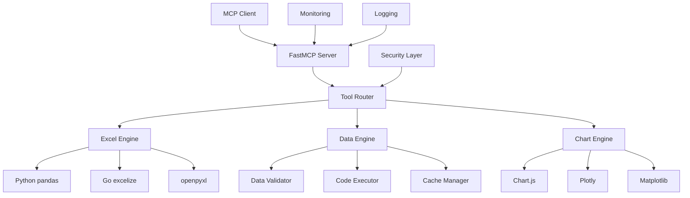
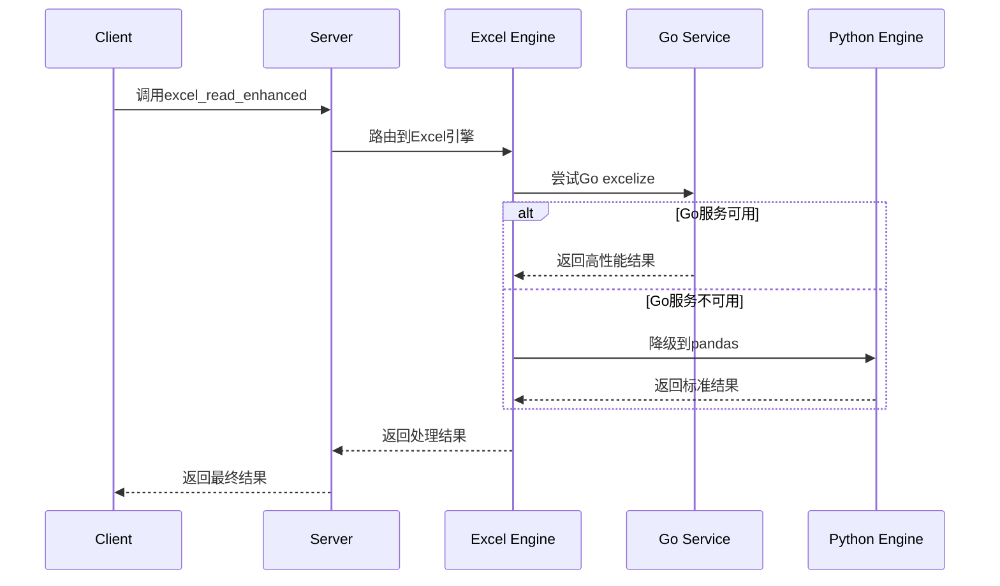
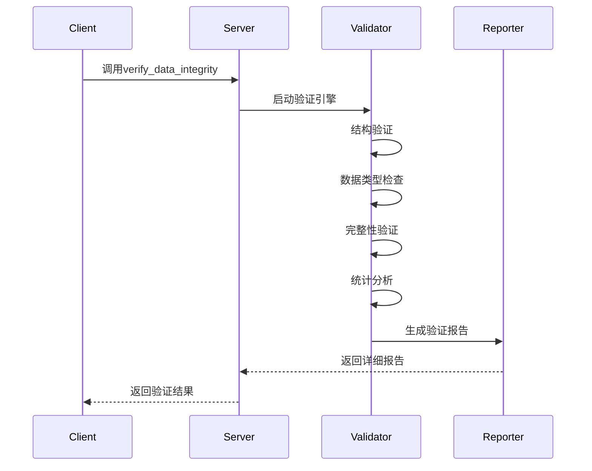
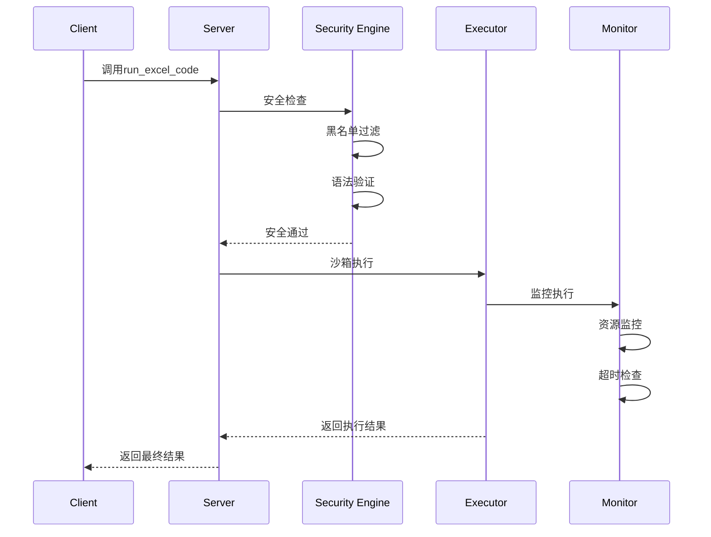
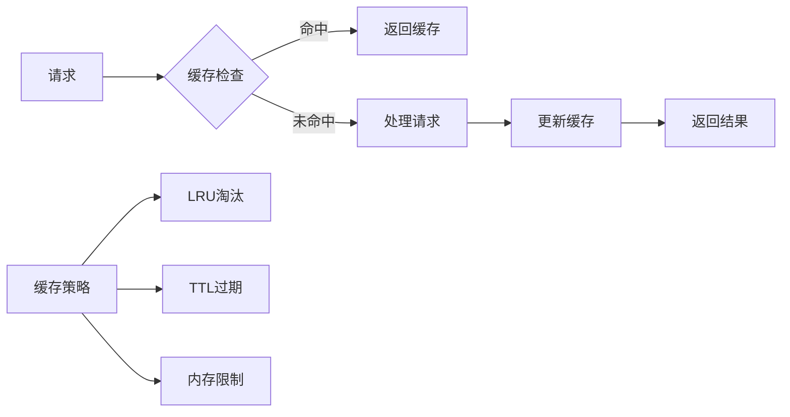
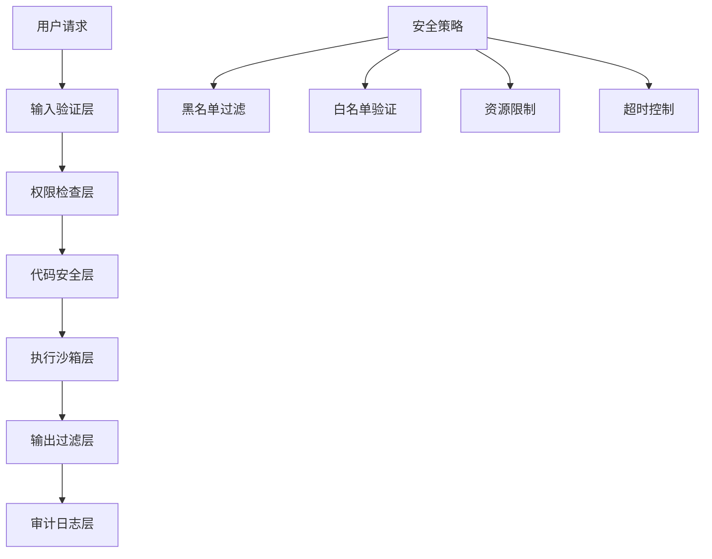
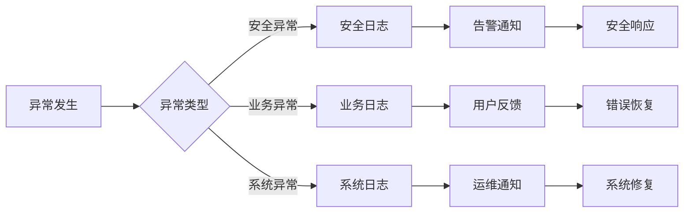
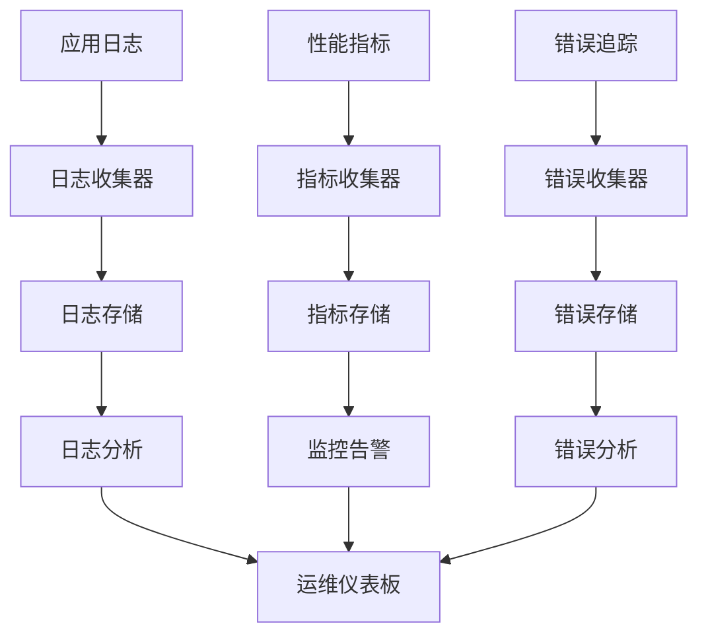

# ChatExcel MCP Server

> 🚀 **企业级Excel智能处理与数据分析MCP服务器** - 基于FastMCP构建的高性能数据处理解决方案

[](https://python.org)
[](https://github.com/jlowin/fastmcp)
[](https://golang.org)
[](LICENSE)
[](pyproject.toml)
[](https://pypi.org/project/formulas/)
[](#-安全考虑)
[](#-性能优化)
[](#-运维工具)

## 📋 项目概述

ChatExcel MCP Server 是一个功能强大的模型上下文协议(MCP)服务器，专门为Excel文件处理、数据分析和可视化而设计。项目集成了Python生态系统的最佳数据处理库，并通过Go excelize库提供高性能Excel操作能力。

### 🎯 核心特性

- **24个专业MCP工具** - 覆盖数据读取、处理、验证、可视化、公式计算全流程
- **双引擎架构** - Python pandas + Go excelize 混合处理引擎
- **Excel公式引擎** - 基于formulas库的完整Excel公式解析、编译和执行系统
- **智能参数推荐** - 自动检测Excel文件结构并推荐最佳读取参数
- **企业级安全** - 多层安全机制，代码沙箱执行环境，公式安全验证
- **性能优化** - 缓存机制、并发处理、内存优化
- **健康监控** - 完整的服务监控、日志记录和错误追踪
- **可视化支持** - 交互式图表生成(Chart.js、Plotly、Matplotlib)

## 🛠️ MCP工具列表

本项目提供 **24个专业MCP工具**，覆盖Excel数据处理、分析、验证和公式计算的完整生命周期。

### 📊 数据读取与元数据工具 (4个)
| 工具名称 | 功能描述 | 主要特性 |
|---------|----------|----------|
| `read_metadata` | CSV文件元数据读取和智能分析 | 编码检测、分隔符识别、数据统计 |
| `read_excel_metadata` | Excel文件元数据读取和完整性验证 | 多工作表分析、智能编码检测 |
| `excel_read_enhanced` | 增强版Excel读取工具 | Go excelize集成、智能参数推荐 |
| `excel_info_enhanced` | 增强版Excel文件信息获取 | 详细文件分析、工作表统计 |

### 🔧 数据处理与执行工具 (6个)
| 工具名称 | 功能描述 | 主要特性 |
|---------|----------|----------|
| `run_excel_code` | Excel代码执行引擎 | 安全沙箱、复杂格式参数支持 |
| `run_code` | CSV代码执行引擎 | 安全环境、pandas集成 |
| `excel_write_enhanced` | 增强版Excel写入工具 | 格式优化、样式支持 |
| `excel_chart_enhanced` | 增强版Excel图表生成 | 多种图表类型、自定义样式 |
| `excel_performance_comparison` | Excel性能对比分析 | Go vs Python性能测试 |
| `batch_data_verification_tool` | 批量数据验证工具 | 并发处理、批量报告 |

### 📈 数据可视化工具 (3个)
| 工具名称 | 功能描述 | 主要特性 |
|---------|----------|----------|
| `bar_chart_to_html` | 交互式柱状图生成 | Chart.js、响应式设计 |
| `pie_chart_to_html` | 交互式饼图生成 | 动画效果、数据标签 |
| `line_chart_to_html` | 交互式折线图生成 | 多维数据、趋势分析 |

### 🔍 数据验证与质量工具 (3个)
| 工具名称 | 功能描述 | 主要特性 |
|---------|----------|----------|
| `verify_data_integrity` | 数据完整性验证和比对核准 | 多种验证模式、详细报告 |
| `validate_data_quality` | 数据质量验证和改进建议 | 质量评分、优化建议 |
| `comprehensive_data_verification_tool` | 综合数据验证和核准工具 | 全面验证、质量评估、比对核准 |

### 🤖 智能辅助工具 (3个)
| 工具名称 | 功能描述 | 主要特性 |
|---------|----------|----------|
| `suggest_excel_read_parameters_tool` | Excel读取参数智能推荐 | 结构分析、参数优化 |
| `detect_excel_file_structure_tool` | Excel文件结构检测 | 多级表头、数据区域识别 |
| `create_excel_read_template_tool` | Excel读取代码模板生成 | 智能模板、参数配置 |

### 🧮 Excel公式处理工具 (5个) - **新增**
| 工具名称 | 功能描述 | 主要特性 |
|---------|----------|----------|
| `parse_formula` | Excel公式解析器 | AST解析、语法分析、安全验证 |
| `compile_workbook` | Excel工作簿编译器 | 公式编译、代码生成、依赖分析 |
| `execute_formula` | Excel公式执行引擎 | 安全执行、上下文支持、结果验证 |
| `analyze_dependencies` | Excel公式依赖分析 | 依赖图生成、循环检测、影响分析 |
| `validate_formula` | Excel公式验证器 | 安全检查、语法验证、风险评估 |

---

## 🧮 Excel公式处理功能详解

### 功能概述

基于 `formulas==1.2.10` 库构建的完整Excel公式处理系统，提供从解析到执行的全流程支持。

### 核心工具详解

#### 1. `parse_formula` - 公式解析器
```python
# 解析Excel公式并获取AST结构
result = parse_formula("=SUM(A1:A10)*2", validate_security=True)
# 返回: 语法树、函数列表、引用单元格、安全状态
```

#### 2. `compile_workbook` - 工作簿编译器
```python
# 将Excel文件编译为Python代码或JSON结构
result = compile_workbook("/path/to/file.xlsx", output_format="python")
# 支持格式: 'python', 'json'
```

#### 3. `execute_formula` - 公式执行引擎
```python
# 在指定上下文中执行Excel公式
context = '{"A1": 10, "A2": 20}'
result = execute_formula("=A1+A2", context)
# 返回: 计算结果、执行状态、性能指标
```

#### 4. `analyze_dependencies` - 依赖分析器
```python
# 分析Excel文件中的公式依赖关系
result = analyze_dependencies("/path/to/file.xlsx")
# 返回: 依赖图、循环检测、影响分析
```

#### 5. `validate_formula` - 公式验证器
```python
# 验证公式的安全性和有效性
result = validate_formula("=SUM(A1:A10)")
# 返回: 安全评估、语法检查、风险等级
```

### 安全特性

- **AST安全分析**: 检测潜在的恶意代码模式
- **函数白名单**: 仅允许安全的Excel函数
- **引用验证**: 验证单元格引用的合法性
- **执行沙箱**: 隔离的公式执行环境

### 性能优化

- **缓存机制**: 解析结果智能缓存
- **并发支持**: 多公式并行处理
- **内存管理**: 大文件分块处理
- **错误恢复**: 优雅的异常处理

---

## 🚀 快速开始

### 环境要求

- **Python**: 3.11+
- **操作系统**: macOS, Linux, Windows
- **内存**: 建议4GB+
- **磁盘空间**: 500MB+

### 一键部署

```bash
# 克隆项目
git clone <repository-url>
cd chatExcel-mcp

# 一键部署（推荐）
./start.sh --deploy

# 启动增强版服务器
./start.sh
```

### 手动安装

```bash
# 1. 创建虚拟环境
python3 -m venv venv
source venv/bin/activate  # macOS/Linux
# venv\Scripts\activate  # Windows

# 2. 安装依赖
pip install -r requirements.txt

# 3. 启动服务器
python3 server.py
```

### Docker部署

```bash
# 构建镜像
docker build -t chatexcel-mcp .

# 运行容器
docker run -p 8080:8080 -v $(pwd)/data:/app/data chatexcel-mcp
```

## 📖 使用示例

### 基础Excel读取

```python
# 使用MCP工具读取Excel文件
result = await mcp_client.call_tool(
    "read_excel_metadata",
    {"file_path": "/path/to/your/file.xlsx"}
)

print(f"工作表数量: {result['sheets_count']}")
print(f"数据行数: {result['total_rows']}")
```

### 智能参数推荐

```python
# 获取最佳读取参数
params = await mcp_client.call_tool(
    "suggest_excel_read_parameters",
    {"file_path": "/path/to/complex.xlsx"}
)

# 使用推荐参数读取
data = await mcp_client.call_tool(
    "excel_read_enhanced",
    {
        "file_path": "/path/to/complex.xlsx",
        **params["recommended_params"]
    }
)
```

### 数据处理与分析

```python
# 执行数据分析代码
analysis = await mcp_client.call_tool(
    "run_excel_code",
    {
        "file_path": "/path/to/data.xlsx",
        "code": """
        # 数据清洗和分析
        df_clean = df.dropna()
        summary = df_clean.describe()
        correlation = df_clean.corr()
        
        print("数据摘要:")
        print(summary)
        """
    }
)
```

### 可视化图表生成

```python
# 生成交互式柱状图
chart = await mcp_client.call_tool(
    "bar_chart_to_html",
    {
        "labels": ["Q1", "Q2", "Q3", "Q4"],
        "datasets": [
            {
                "label": "销售额",
                "data": [120, 150, 180, 200]
            }
        ],
        "title": "季度销售报告"
    }
)

print(f"图表已生成: {chart['filepath']}")
```

## 🏗️ 项目架构

### 系统架构图



### 核心模块

#### 📁 主要文件结构

```
chatExcel-mcp/
├── server.py                 # 主服务器文件（19个MCP工具）
├── enhanced_server.py        # 增强版服务器
├── config.py                 # 配置管理
├── excel_enhanced_tools.py   # Excel增强工具
├── excel_smart_tools.py      # Excel智能工具
├── data_verification.py      # 数据验证引擎
├── comprehensive_data_verification.py  # 综合数据验证
├── excel-service/           # Go excelize服务
│   ├── main.go
│   ├── go.mod
│   └── go.sum
├── templates/               # 图表模板
│   ├── barchart_template.html
│   ├── linechart_template.html
│   └── piechart_template.html
├── scripts/                 # 运维脚本
│   ├── deploy.py
│   ├── health_check.py
│   └── maintenance.sh
├── config/                  # 配置文件
│   ├── runtime.yaml
│   ├── security.json
│   └── system.json
└── tests/                   # 测试套件
    ├── unit/
    ├── integration/
    └── performance/
```

#### 🔧 引擎类设计

- **ExcelEnhancedProcessor**: 高性能Excel处理引擎
- **DataVerificationEngine**: 数据验证和质量检查引擎
- **ComprehensiveDataVerifier**: 综合数据验证器
- **SecureCodeExecutor**: 安全代码执行器

### 数据流架构

#### Excel处理流程



#### 数据验证流程



#### 代码执行流程



### 性能优化架构

#### 缓存机制



#### 并发处理

```python
# 并发处理示例
class ConcurrentProcessor:
    def __init__(self, max_workers=4):
        self.executor = ThreadPoolExecutor(max_workers=max_workers)
        self.semaphore = asyncio.Semaphore(max_workers)
    
    async def process_batch(self, tasks):
        async with self.semaphore:
            futures = [self.executor.submit(task) for task in tasks]
            results = await asyncio.gather(*futures)
            return results
```

### 安全架构设计

#### 多层安全防护



#### 错误处理机制



### 扩展性设计

#### 插件架构

```python
# 插件接口定义
class MCPToolPlugin:
    def __init__(self, name: str, version: str):
        self.name = name
        self.version = version
    
    def register_tools(self, mcp_server):
        """注册MCP工具"""
        raise NotImplementedError
    
    def initialize(self, config: dict):
        """初始化插件"""
        pass
    
    def cleanup(self):
        """清理资源"""
        pass

# 插件管理器
class PluginManager:
    def __init__(self):
        self.plugins = {}
    
    def load_plugin(self, plugin_class, config=None):
        plugin = plugin_class()
        plugin.initialize(config or {})
        self.plugins[plugin.name] = plugin
        return plugin
```

#### 配置管理

```python
# 动态配置示例
class ConfigManager:
    def __init__(self, config_path="config/"):
        self.config_path = Path(config_path)
        self.configs = {}
        self.watchers = {}
    
    def load_config(self, name: str) -> dict:
        config_file = self.config_path / f"{name}.yaml"
        with open(config_file, 'r') as f:
            config = yaml.safe_load(f)
        self.configs[name] = config
        return config
    
    def watch_config(self, name: str, callback):
        """监控配置文件变化"""
        self.watchers[name] = callback
```

### 监控与运维架构

#### 健康检查

```python
# 健康检查示例
class HealthChecker:
    def __init__(self):
        self.checks = {
            "database": self.check_database,
            "cache": self.check_cache,
            "disk_space": self.check_disk_space,
            "memory": self.check_memory
        }
    
    async def run_health_check(self) -> dict:
        results = {}
        for name, check_func in self.checks.items():
            try:
                results[name] = await check_func()
            except Exception as e:
                results[name] = {"status": "error", "error": str(e)}
        
        overall_status = "healthy" if all(
            r.get("status") == "healthy" for r in results.values()
        ) else "unhealthy"
        
        return {
            "status": overall_status,
            "checks": results,
            "timestamp": datetime.utcnow().isoformat()
        }
```

#### 日志与监控



## 🧪 测试与验证

### 运行测试套件

```bash
# 运行所有测试
python3 -m pytest tests/ -v

# 运行特定测试
python3 comprehensive_mcp_test.py
python3 final_verification.py

# 性能测试
python3 test/performance/benchmark.py
```

### 健康检查

```bash
# 服务健康检查
curl http://localhost:8080/health

# 详细诊断
python3 diagnose_mcp_setup.py

# Excel功能验证
python3 demo_excel_features.py
```

### 核心依赖验证

```bash
# NumPy和Pandas功能验证
python3 -c "import numpy as np; import pandas as pd; print('✅ 核心依赖正常')"

# Excel智能处理功能测试
python3 test_excel_smart_features.py

# Go服务连接测试
python3 excel_go_client.py --test
```

## 🔒 安全考虑

### 代码执行安全

- **黑名单过滤**: 禁止危险操作（os, sys, subprocess等）
- **沙箱环境**: 隔离代码执行环境
- **资源限制**: 内存、CPU、执行时间限制
- **输入验证**: 严格的参数验证和类型检查

### 文件访问安全

- **路径验证**: 防止目录遍历攻击
- **文件大小限制**: 防止大文件攻击
- **格式验证**: 确保文件格式正确性
- **权限检查**: 文件读写权限验证

### 网络安全

- **HTTPS支持**: 加密传输
- **认证机制**: API密钥验证
- **速率限制**: 防止DDoS攻击
- **审计日志**: 完整的操作记录

## 🛠️ 运维工具

### 自动化脚本

```bash
# 部署脚本
./scripts/deploy.py --env production

# 健康检查
./scripts/health_check.py --detailed

# 维护脚本
./scripts/maintenance.sh --clean-cache

# 依赖更新
./scripts/update_dependencies.sh
```

### 缓存管理

```bash
# 清理缓存
python3 cache_manager.py --clean

# 缓存统计
python3 cache_manager.py --stats

# 缓存配置
vim cache_config.json
```

### 日志管理

```bash
# 查看实时日志
tail -f logs/chatExcel.log

# 日志分析
python3 scripts/log_analyzer.py --date today

# 日志轮转
logrotate config/logrotate.conf
```

## ⚡ 性能优化

### 内存优化

- **分块读取**: 大文件分块处理
- **内存池**: 对象重用机制
- **垃圾回收**: 主动内存清理
- **缓存策略**: LRU缓存淘汰

### 并发优化

- **异步处理**: asyncio并发模型
- **线程池**: CPU密集型任务并行
- **连接池**: 数据库连接复用
- **队列机制**: 任务队列管理

### I/O优化

- **批量操作**: 减少I/O次数
- **压缩传输**: 数据压缩传输
- **预读取**: 智能数据预加载
- **缓存命中**: 提高缓存命中率

## 🐛 故障排除

### 常见问题

#### 1. 服务启动失败

```bash
# 检查端口占用
lsof -i :8080

# 检查依赖
pip check

# 查看详细错误
python3 server.py --debug
```

#### 2. Excel读取失败

```bash
# 检查文件权限
ls -la /path/to/file.xlsx

# 验证文件格式
file /path/to/file.xlsx

# 测试读取
python3 simple_test.py /path/to/file.xlsx
```

#### 3. Go服务连接失败

```bash
# 检查Go服务状态
ps aux | grep excel-service

# 重启Go服务
cd excel-service && ./excel-service

# 测试连接
curl http://localhost:8081/health
```

### 调试工具

```bash
# 简单调试
python3 simple_debug.py

# 全面诊断
python3 diagnose_mcp_setup.py

# 性能分析
python3 -m cProfile server.py
```

## 📄 许可证

本项目采用 [MIT License](LICENSE) 开源协议。

## 🤝 贡献指南

我们欢迎社区贡献！请遵循以下步骤：

1. **Fork** 本仓库
2. 创建特性分支 (`git checkout -b feature/AmazingFeature`)
3. 提交更改 (`git commit -m 'Add some AmazingFeature'`)
4. 推送到分支 (`git push origin feature/AmazingFeature`)
5. 开启 **Pull Request**

### 开发规范

- 遵循 [PEP 8](https://www.python.org/dev/peps/pep-0008/) 代码风格
- 添加适当的测试用例
- 更新相关文档
- 确保所有测试通过

### 代码质量检查

```bash
# 代码格式化
black .

# 代码检查
flake8 .

# 类型检查
mypy .

# 安全检查
bandit -r .
```

## 📞 联系方式

- **项目维护者**: ChatExcel Team
- **问题反馈**: [GitHub Issues](https://github.com/Lillard01/chatExcel-mcp/issues)
- **功能建议**: [GitHub Discussions](https://github.com/Lillard01/chatExcel-mcp/discussions)
- **技术支持**: Lillardw459@gmail.com

## 🙏 致谢

感谢以下开源项目的支持：

- [FastMCP](https://github.com/jlowin/fastmcp) - MCP服务器框架
- [pandas](https://pandas.pydata.org/) - 数据分析库
- [openpyxl](https://openpyxl.readthedocs.io/) - Excel文件处理
- [excelize](https://github.com/qax-os/excelize) - Go Excel库
- [formulas](https://github.com/vinci1it2000/formulas) - Excel公式解析和执行引擎
- [Chart.js](https://www.chartjs.org/) - 图表可视化
- [Plotly](https://plotly.com/) - 交互式图表

---

<div align="center">

**⭐ 如果这个项目对您有帮助，请给我们一个星标！**

[⬆ 回到顶部](#chatexcel-mcp-server)

</div>
